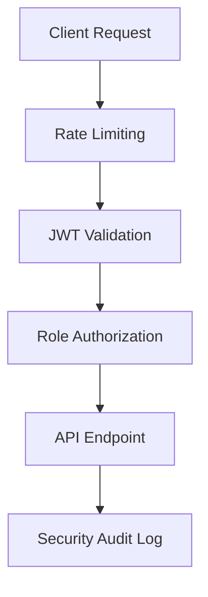

# 🏘️ MTAANI - Community Business Platform

[](https://nextjs.org/)
[](https://www.typescriptlang.org/)
[](https://couchdb.apache.org/)
[](LICENSE)
[](CONTRIBUTING.md)

> **A comprehensive platform connecting local businesses with their communities across Kenya.**
> Built with modern web technologies, featuring subscription management, real-time analytics, and secure payment integration.

## 📋 Table of Contents

- [🚀 Quick Start](#-quick-start)
- [🏗️ Architecture](#️-architecture)
- [🔧 Development Setup](#-development-setup)
- [🗄️ Database](#️-database)
- [🔐 Authentication & Security](#-authentication--security)
- [💳 Subscription System](#-subscription-system)
- [📡 API Reference](#-api-reference)
- [🚀 Deployment](#-deployment)
- [🧪 Testing](#-testing)
- [🤝 Contributing](#-contributing)
- [📚 Documentation](#-documentation)

## 🚀 Quick Start

Get up and running in under 5 minutes:

```bash
# 1. Clone the repository
git clone https://github.com/moodykhalif23/mtaani.git
cd mtaani

# 2. Install dependencies (using pnpm for faster installs)
pnpm install

# 3. Setup environment variables
cp .env.example .env.local
# Edit .env.local with your configuration (JWT secrets are pre-generated)

# 4. Start development server
pnpm dev
```

🌐 **Open [http://localhost:3000](http://localhost:3000)** to view the application.

### 🎯 Demo Accounts (Development Only)
```
👤 Regular User:     user@example.com / secret123
🏢 Business Owner:   business@example.com / secret123
👨‍💼 Admin:           admin@example.com / secret123
```

## 🏗️ Architecture

### Tech Stack

| Layer | Technology | Purpose |
|-------|------------|---------|
| **Frontend** | Next.js 14, TypeScript, Tailwind CSS, Shadcn/ui | Modern React framework with server-side rendering |
| **Backend** | Next.js API Routes, JWT Authentication | Serverless API with secure authentication |
| **Database** | CouchDB (NoSQL) | Document-based storage with built-in replication |
| **Payments** | M-Pesa, Stripe | Local and international payment processing |
| **Storage** | Local/AWS S3/Cloudinary | File storage and image optimization |
| **Monitoring** | Built-in Analytics, Security Audit | Real-time monitoring and security tracking |

### Key Features

✅ **Multi-tenant SaaS Architecture**
✅ **Role-based Access Control (RBAC)**
✅ **Real-time Analytics Dashboard**
✅ **Subscription Management**
✅ **API Rate Limiting & Security**
✅ **Mobile-responsive Design**
✅ **SEO Optimized**
✅ **PWA Ready**

## 🔧 Development Setup

### Prerequisites

- **Node.js** 18.17+ ([Download](https://nodejs.org/))
- **pnpm** 8.0+ (`npm install -g pnpm`)
- **CouchDB** 3.3+ ([Installation Guide](docs/COUCHDB_SETUP.md))
- **Git** ([Download](https://git-scm.com/))

### Environment Variables

Create `.env.local` from the example:

```bash
cp .env.example .env.local
```

**Required Configuration:**
```bash
# 🔐 Security (Pre-generated - Change in production)
JWT_SECRET=mK8vN2pQ7rS9tU1wX4yZ6aB3cD5eF8gH...
JWT_REFRESH_SECRET=nL9wO3qR8sT0uV2xY5zA7bC4dE6fG9hI...
SECURITY_VALIDATION_TOKEN=dev_validation_token_2024_secure...

# 🗄️ Database
COUCHDB_URL=http://localhost:5984
COUCHDB_USERNAME=admin
COUCHDB_PASSWORD=dev_couchdb_password_2024_secure

# 📧 Email (Optional for development)
SENDGRID_API_KEY=your_sendgrid_key_here

# 💳 Payments (Optional for development)
MPESA_CONSUMER_KEY=your_mpesa_consumer_key
MPESA_CONSUMER_SECRET=your_mpesa_consumer_secret
STRIPE_SECRET_KEY=your_stripe_secret_key

# 🗺️ Maps (Optional)
GOOGLE_MAPS_API_KEY=your_google_maps_api_key
```

### Development Commands

```bash
# 🚀 Start development server
pnpm dev

# 🏗️ Build for production
pnpm build

# ▶️ Start production server
pnpm start

# 🔍 Type checking
pnpm type-check

# 🧹 Linting & formatting
pnpm lint
pnpm lint:fix

# 🧪 Run tests
pnpm test
pnpm test:watch

# 📊 Bundle analysis
pnpm analyze
```


## 🗄️ Database

### CouchDB Schema

| Document Type | Purpose | Key Fields |
|---------------|---------|------------|
| `users` | User accounts | email, role, verification, security |
| `businesses` | Business listings | name, category, location, subscription |
| `subscriptions` | Billing & plans | userId, plan, status, usage |
| `reviews` | User reviews | businessId, rating, content |
| `events` | Community events | title, date, location, organizer |
| `sessions` | User sessions | userId, token, expiry |
| `security_audit` | Security logs | eventType, severity, timestamp |

### Database Features

🔹 **NoSQL Document Storage** - Flexible schema for rapid development
🔹 **Built-in Replication** - Multi-master synchronization
🔹 **REST API Integration** - Direct HTTP access
🔹 **Geospatial Queries** - Location-based business search
🔹 **ACID Transactions** - Data consistency guarantees

## 🔐 Authentication & Security

### Security Architecture



### Security Features

| Feature | Implementation | Status |
|---------|----------------|--------|
| **JWT Authentication** | Access + Refresh tokens | ✅ Implemented |
| **Role-based Access** | user, business_owner, admin | ✅ Implemented |
| **Rate Limiting** | Per-endpoint limits | ✅ Implemented |
| **Account Security** | Login attempts, lockout | ✅ Implemented |
| **API Security** | CORS, validation, sanitization | ✅ Implemented |
| **Audit Logging** | All security events tracked | ✅ Implemented |
| **MFA Support** | Email/SMS verification | 🚧 Planned |
| **OAuth Integration** | Google, Facebook login | 🚧 Planned |

### User Roles & Permissions

```typescript
// Role hierarchy and permissions
const ROLES = {
  user: ['read:businesses', 'create:reviews'],
  business_owner: ['manage:business', 'read:analytics'],
  admin: ['manage:all', 'read:audit', 'manage:users']
}
```


### Payment Integration

🇰🇪 **M-Pesa Integration**
- STK Push for seamless payments
- Automatic subscription renewal
- Transaction verification

🌍 **Stripe Integration**
- International card payments
- Subscription management
- Webhook handling

### Usage Tracking

```typescript
// Real-time usage monitoring
const usageTracking = {
  businessListings: { current: 2, limit: 5 },
  photoUploads: { current: 15, limit: Infinity },
  apiCalls: { current: 1250, limit: 10000, resetDate: '2024-02-01' }
}
```

## 📡 API Reference

### Authentication Endpoints

| Method | Endpoint | Description | Auth Required |
|--------|----------|-------------|---------------|
| `POST` | `/api/auth/login` | User login | ❌ |
| `POST` | `/api/auth/signup` | User registration | ❌ |
| `POST` | `/api/auth/logout` | User logout | ✅ |
| `POST` | `/api/auth/refresh` | Refresh access token | ✅ |
| `POST` | `/api/auth/verify-email` | Email verification | ❌ |
| `POST` | `/api/auth/forgot-password` | Password reset | ❌ |

### Business Endpoints

| Method | Endpoint | Description | Auth Required |
|--------|----------|-------------|---------------|
| `GET` | `/api/businesses` | Search businesses | ❌ |
| `POST` | `/api/businesses` | Create business | ✅ (business_owner) |
| `GET` | `/api/businesses/[id]` | Get business details | ❌ |
| `PUT` | `/api/businesses/[id]` | Update business | ✅ (owner/admin) |
| `DELETE` | `/api/businesses/[id]` | Delete business | ✅ (owner/admin) |

### Subscription Endpoints

| Method | Endpoint | Description | Auth Required |
|--------|----------|-------------|---------------|
| `GET` | `/api/subscription/status` | Get subscription status | ✅ |
| `POST` | `/api/subscription/upgrade` | Upgrade plan | ✅ |
| `POST` | `/api/subscription/validate` | Validate feature access | ✅ |
| `GET` | `/api/subscription/usage` | Get usage statistics | ✅ |

### Admin Endpoints

| Method | Endpoint | Description | Auth Required |
|--------|----------|-------------|---------------|
| `GET` | `/api/admin/dashboard` | Admin dashboard data | ✅ (admin) |
| `GET` | `/api/admin/analytics` | Platform analytics | ✅ (admin) |
| `GET` | `/api/admin/export` | Export data | ✅ (admin) |
| `GET` | `/api/admin/api-keys` | Manage API keys | ✅ (admin) |

### External API (v1)

| Method | Endpoint | Description | Auth Required |
|--------|----------|-------------|---------------|
| `GET` | `/api/v1/businesses` | Public business API | ✅ (API Key) |
| `GET` | `/api/v1/events` | Public events API | ✅ (API Key) |

### Response Format

```typescript
// Success Response
{
  "success": true,
  "data": { ... },
  "meta": {
    "timestamp": "2024-01-15T10:30:00Z",
    "version": "1.0.0"
  }
}

// Error Response
{
  "success": false,
  "error": {
    "code": "VALIDATION_ERROR",
    "message": "Invalid input data",
    "details": { ... }
  }
}
```

## 🚀 Deployment

### Production Deployment Checklist

- [ ] **Environment Variables** - Set production secrets
- [ ] **Database Setup** - Configure CouchDB cluster
- [ ] **SSL Certificates** - Enable HTTPS
- [ ] **Domain Configuration** - Set up custom domain
- [ ] **Monitoring** - Configure error tracking
- [ ] **Backup Strategy** - Set up automated backups

### Deployment Options

#### 🌐 Vercel (Recommended)

```bash
# 1. Install Vercel CLI
npm i -g vercel

# 2. Deploy to Vercel
vercel --prod

# 3. Set environment variables in Vercel dashboard
```

#### 🐳 Docker Deployment

```bash
# 1. Build Docker image
docker build -t mtaani:latest .

# 2. Run with docker-compose
docker-compose up -d

# 3. Check health
curl http://localhost:3000/api/health
```

#### ☁️ AWS/GCP/Azure

```bash
# 1. Build for production
pnpm build

# 2. Start production server
NODE_ENV=production pnpm start

# 3. Configure reverse proxy (nginx/apache)
```

### Environment Setup

```bash
# Generate production secrets
node scripts/setup-env.js production

# Verify configuration
pnpm run config:verify
```

### Database Migration

```bash
# Run database migrations
pnpm run db:migrate

# Seed initial data
pnpm run db:seed
```

## 🧪 Testing

### Running Tests

```bash
# Run all tests
pnpm test

# Run specific test suites
pnpm test:unit
pnpm test:integration
pnpm test:e2e

# Run tests in watch mode
pnpm test:watch

# Generate coverage report
pnpm test:coverage
```

### Test Examples

```typescript
// Unit test example
describe('BusinessService', () => {
  it('should create a business', async () => {
    const business = await businessService.create(mockBusinessData)
    expect(business.success).toBe(true)
  })
})

// Integration test example
describe('POST /api/businesses', () => {
  it('should create business with valid auth', async () => {
    const response = await request(app)
      .post('/api/businesses')
      .set('Authorization', `Bearer ${validToken}`)
      .send(businessData)

    expect(response.status).toBe(201)
  })
})
```

## 🤝 Contributing

We welcome contributions from the community! Here's how to get started:

### Development Workflow

1. **Fork & Clone**
   ```bash
   git clone https://github.com/yourusername/mtaani.git
   cd mtaani
   ```

2. **Create Feature Branch**
   ```bash
   git checkout -b feature/your-feature-name
   ```

3. **Make Changes**
   - Follow the coding standards
   - Add tests for new features
   - Update documentation

4. **Test Your Changes**
   ```bash
   pnpm lint
   pnpm type-check
   pnpm test
   ```

5. **Commit & Push**
   ```bash
   git commit -m "feat: add amazing feature"
   git push origin feature/your-feature-name
   ```

6. **Open Pull Request**
   - Use the PR template
   - Link related issues
   - Add screenshots for UI changes

### Coding Standards

- **TypeScript** - Strict mode enabled
- **ESLint** - Follow the configured rules
- **Prettier** - Auto-formatting on save
- **Conventional Commits** - Use semantic commit messages

### Commit Message Format

```
type(scope): description

feat(auth): add OAuth integration
fix(api): resolve rate limiting issue
docs(readme): update installation guide
```

## 📚 Documentation

| Document | Description |
|----------|-------------|
| [🗄️ CouchDB Setup](docs/COUCHDB_SETUP.md) | Database installation and configuration |
| [📡 API Documentation](docs/API_DOCUMENTATION.md) | Complete REST API reference |
| [🔧 Environment Setup](docs/ENVIRONMENT_SETUP.md) | Environment configuration guide |
| [🚀 Deployment Guide](docs/DEPLOYMENT.md) | Production deployment instructions |
| [🧪 Testing Guide](docs/TESTING.md) | Testing strategies and examples |
| [🤝 Contributing Guide](CONTRIBUTING.md) | Detailed contribution guidelines |

## 🐛 Issues & Support

- **🐛 Bug Reports**: [Create an issue](https://github.com/moodykhalif23/mtaani/issues/new?template=bug_report.md)
- **💡 Feature Requests**: [Create an issue](https://github.com/moodykhalif23/mtaani/issues/new?template=feature_request.md)
- **❓ Questions**: [Discussions](https://github.com/moodykhalif23/mtaani/discussions)
- **📧 Email**: support@mtaani.co.ke

## 📊 Project Status

| Metric | Status |
|--------|--------|
| **Build** | [](https://github.com/moodykhalif23/mtaani/actions) |
| **Coverage** | [](https://codecov.io/gh/moodykhalif23/mtaani) |
| **Dependencies** | [](https://david-dm.org/moodykhalif23/mtaani) |
| **License** | [](LICENSE) |

## 🗺️ Roadmap

### Q1 2024
- [ ] Mobile app (React Native)
- [ ] Advanced analytics
- [ ] Multi-language support

### Q2 2024
- [ ] AI-powered recommendations
- [ ] Advanced search filters
- [ ] Integration marketplace

### Q3 2024
- [ ] White-label solutions
- [ ] Enterprise features
- [ ] API v2 release

## 📄 License

This project is licensed under the MIT License - see the [LICENSE](LICENSE) file for details.

## 🙏 Acknowledgments

- **Next.js Team** - For the amazing framework
- **CouchDB Community** - For the robust database
- **Kenyan Developer Community** - For inspiration and feedback
- **All Contributors** - Thank you for making this project better!

---

<div align="center">

**🏘️ Built with ❤️ for Kenyan communities**

[Website](https://mtaani.co.ke) • [Documentation](docs/) • [API](https://api.mtaani.co.ke) • [Support](mailto:support@mtaani.co.ke)

</div>
